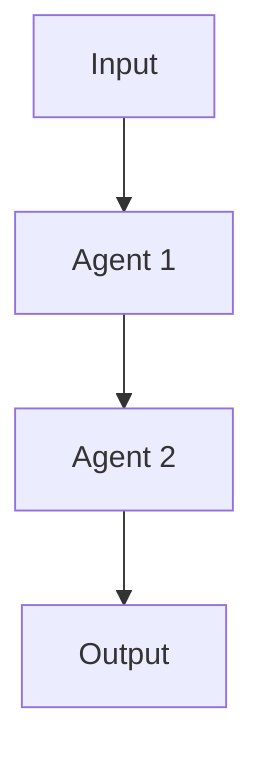

# Create Workflow Prompt

エージェント/ワークフローを設計・作成するための統合プロンプトです。
シンプルな単一エージェントから複雑なマルチエージェント構成まで対応します。

---

## ヒアリング開始

以下の質問でユーザーの要件を確認してください：

```
どんなエージェント/ワークフローを作りたい？🎀

教えてほしいこと：
1. **何を達成したい？** （例: レポート生成、コードレビュー、自動化...）
2. **複雑さは？** （シンプル=1エージェント / 複雑=複数エージェント連携）
3. **入力は？** （例: ファイル、API、ユーザー入力...）
4. **出力は？** （例: Markdown、ファイル生成、通知...）

ざっくりでOK！詳しくは一緒に詰めていくよ〜✨
```

---

## 設計原則（必ず守る）

### Do ✅

- **単一責務**: 1 エージェント = 1 つの役割
- **冪等性**: 同じ入力なら同じ結果
- **IR 活用**: エージェント間は YAML/JSON で受け渡し
- **フェイルセーフ**: エラー時の対応を明記
- **レビュー分離**: 最終チェックは別エージェントで

### Don't ❌

- 1 つのエージェントに全部やらせる
- 循環依存（A → B → A）を作る
- 長文プロンプトを書く
- `/dev/null` へのリダイレクト
- `git push` を自動実行

---

## 出力パターン

### パターン A: シンプル（単一エージェント）

```markdown
# [Agent Name]

## Role

[このエージェントの役割を 1-2 文で]

## Goals

- [達成したいこと 1]
- [達成したいこと 2]

## Permissions

- **Allowed**: [許可する操作]
- **Denied**: git push、ファイル削除

## Workflow

1. [ステップ 1]
2. [ステップ 2]
3. [ステップ 3]
```

### パターン B: 複雑（マルチエージェント）

````markdown
# [Workflow Name]

## Overview

[ワークフローの概要]

## Agents

### 1. [Agent 1 Name]

- **Role**: [役割]
- **Input**: [入力]
- **Output**: [出力（IR 形式）]

### 2. [Agent 2 Name]

- **Role**: [役割]
- **Input**: [Agent 1 の Output]
- **Output**: [最終成果物]

## Flow


````

## Error Handling

- [エラー時の対応]

```

---

## ヒアリング詳細（必要に応じて確認）

### 入出力

```

入出力を整理するね 💕

**入力について：**

- 何を入力として受け取る？
- フォーマットは？（JSON、テキスト、CLI 引数...）

**出力について：**

- 何を生成したい？
- 出力形式は？（Markdown、CSV、ファイル...）
- 出力先は？（ファイル、Issue、通知...）

```

### ツール・API

```

使うツールや API ある？🙌

- 外部 API（Azure CLI、GitHub CLI、REST API...）
- 認証が必要なもの
- プロジェクト内の既存スクリプト

分からなければ「おまかせ」でも OK！

```

### エラーハンドリング

```

エラー時どうする？

1. リトライ（何回まで？）
2. 人間に報告してストップ
3. スキップして続行
4. フォールバック処理

````

---

## IR（中間表現）テンプレート

複雑なワークフローの場合、以下の形式で設計を構造化：

```yaml
workflow:
  name: "workflow_name"
  purpose: "目的"
  trigger: "manual|schedule|event"

io:
  input:
    source: "入力元"
    format: "JSON|YAML|text"
  output:
    type: "report|file|notification"
    format: "Markdown|CSV|JSON"

agents:
  - name: "agent_1"
    role: "役割"
    input: "入力"
    output: "出力"
  - name: "agent_2"
    role: "役割"
    input: "agent_1の出力"
    output: "最終成果物"

error_handling:
  strategy: "retry|stop|skip"
  max_retries: 3
  fallback: "人間に報告"
````

---

## 出力先

作成したファイルは以下に保存：

- **単一エージェント**: `.github/agents/<name>.agent.md`
- **ワークフロー**: `.github/agents/<name>.agent.md`（オーケストレーター）+ 個別エージェント

作成後、`AGENTS.md` にも追記すること。
